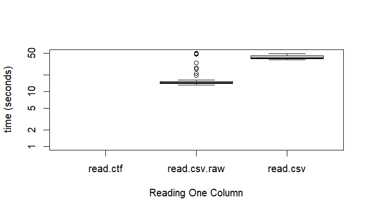
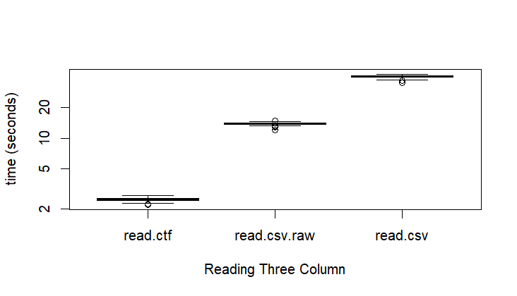

Microbenchmarking CTF against CSV Reading Columns
================
Van Nguyen
2024-07-08

## CTF

CTF (Column Text Format) stores the columns of tabular data in plain
text, combining the simplicity of text with the performance of a column
store.This should allow for faster reads for specific columns over the
built in read.csv and read.csv.raw from `{iotools}` package.

For this microbenchmark, we’ll be using the `{microbenchmark}` package
for R, timing and running reads 100 times for `read.ctf`, `read.csv`,
`read.csv.raw`. The data set used is a flights data set for all months
in 2023 from the Bureau of Transportation Statistics. It is 6.8 million
rows by 22 column dataset.

## Comparing read speed for 1, 3 and 10 columns

<!-- -->

For each read, there is a boxplot representing the 100 reads done
through `{microbenchmark}` . While `read.csv.raw` takes about 16 seconds
on average and `read.csv` takes around 42 seconds on average to complete
their reads, `read.ctf` does not even show on the graph taking 0.4
seconds on average to finish its. It is an over 100 times faster than
`read.csv` and 40 times than `read.csv.raw`.

<!-- -->
<!-- -->

<!-- -->

Even when reading more columns, on average, `read.ctf` is much faster
than `read.csv` and `read.csv.raw`. While the more column mean a long
read time for `read.ctf`, for the other two, despite reading more
columns, takes a similar amount of time to read the columns no matter
how many columns is selected, around 15 seconds for `read.csv.raw` and
around 40 seconds for `read.csv`.

<!-- -->

When reading in the entire dataset, `read.ctf` is slightly slower than
`read.csv.raw` taking 15.3 seconds on average to read the entire dataset
while `read.csv.raw` took 14.5 seconds on average. Due to an outline,
`read.csv` took about 44 seconds on average to read but without it the
average read time would be around 40 seconds.
